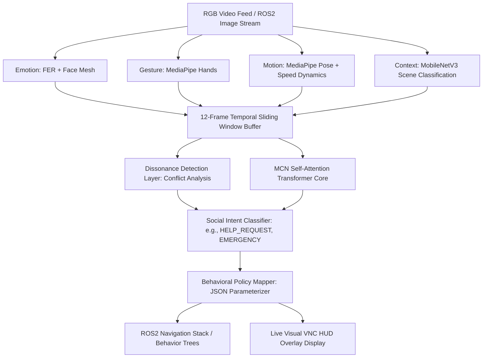

# 🧠 Multimodal Cross-Modal Network (MCN)
### *The Real-Time Social Brain for Adaptive Human-Robot Interaction (HRI)*

[](https://docs.ros.org/en/humble/index.html)
[](https://pytorch.org/)
[](https://google.github.io/mediapipe/)
[](https://onnx.ai/)

An **Adaptive Human-Robot Interaction (HRI) System** designed to act as the cognitive "Social Brain" for service and companion robots. 

This repository implements a lightweight **Multimodal Cross-Modal Transformer Network (MCN)** that fuses 4 upstream vision modalities (Emotion, Gesture, Motion, and Context) in real-time. By analyzing human behavior across a **1.2-second temporal sliding window** (12 frames @ 10Hz), the network detects cognitive dissonance, decodes ambiguous social intents, and outputs structured **JSON policies** containing targeted target velocities, vocal affect tones, and social proxemic buffer zone radii directly into the **ROS2 Navigation Stack**.

---

## 📖 Architectural Diagram



---

## 🛠️ Complete Project Directory Structure

```text
├── mcn/                     # Transformer Fusion Engine ("The Cognitive Brain")
│   ├── model.py             # 3-Layer Self-Attention Transformer Architecture
│   ├── temporal_window.py   # 1.2s (12-Frame) sliding window queue
│   ├── dissonance.py        # Dissonant/Conflicting cue resolver
│   ├── policy_mapper.py     # Intent-to-JSON Proxemic Parameterizer
│   └── train.py             # Synthetic HRI Data Generator & Training Script
├── models/                  # Custom Upstream Modality Wrappers
│   ├── emotion/             # Custom Emotion Model logic & checkpoints (FER)
│   ├── gesture/             # Custom Gesture Model logic (Keypoint+History TFLite)
│   ├── motion/              # Custom Pose/Motion Analyzer (MediaPipe + ResNet50)
│   └── context/             # Custom Context Classifier (MobileNetV3)
├── pipeline/                # Real-Time Orchestration & Simulation Tools
│   ├── video_pipeline.py    # Standard sequential frame processor & visual HUD
│   ├── ros2_mcn_node.py     # Deployed ROS2 Humble Node (Sub/Pub)
│   └── test_publisher.py    # Simulated ROS2 Video Streamer (for cloud VNC tests)
├── TestVideos/              # Interactive test videos (1.mp4 included for ROS2 testing)
├── checkpoints/             # Trained MCN weights (best_model.pt)
├── deployment/              # Dedicated Platform Deployment Guides
│   ├── JETSON_NANO_DEPLOYMENT.md    # Jetson Orin Nano + TensorRT setup
│   ├── PC_LINUX_DEPLOYMENT.md       # Standard Ubuntu + ROS2 setup
│   └── WINDOWS_NO_ROS2_TESTING.md  # Windows local environment & Cloud VNC guide
├── select_and_run.py        # Windows/Linux Local Interactive Console Menu
└── requirements.txt         # strictly locked cross-platform dependencies
```

---

## 🚀 Vision Modalities Deep Dive

To understand how the robot perceives its environment, we implement 4 highly optimized modular wrappers inside the `models/` directory:
1. **Facial Affect (Emotion)**: Evaluates the facial expression (Angry, Happy, Sad, Fearful, Confused, Neutral) to assess user state and comfort levels.
2. **Skeletal Hand (Gesture)**: Evaluates finger posture and pointing keypoints. Uses **lightweight `.tflite` interpreters** with custom fallbacks to run TensorFlow model classifiers in milliseconds on Edge CPU.
3. **Kinematic Body (Motion)**: Uses MediaPipe Pose to calculate skeletal coordinate velocities (depth, lateral, and vertical speed vectors) to identify actions (e.g. running, falling, sitting, waving).
4. **Environment (Context)**: Uses a MobileNetV3 backbone to classify the scene context (Kitchen, Corridor, Office, Lounge) to adapt proxemic social rules dynamically depending on constraints.

---

## 🛠️ Local Installation & Windows Setup

To prevent "dependency hell" (specifically with `numpy` and `protobuf` version conflicts between ROS2 and MediaPipe), follow these instructions:

### 1. Set Up the Virtual Environment
```powershell
# Open terminal inside workspace and run:
python -m venv env

# Activate the environment:
.\env\Scripts\activate
```

### 2. Install strictly locked dependencies
```powershell
pip install -r requirements.txt
```
*(This automatically resolves the `ml-dtypes` and `protobuf` constraints to keep your local machine 100% healthy!)*

### 3. Run Local Interactive Video Selector
```powershell
python select_and_run.py
```
*Enter any video number (e.g., `1` or `27`) to watch the pipeline dynamically analyze the video frame-by-frame on your local machine!*

---

## 🌐 Headless & Graphical Cloud Deployment (ROS2 Humble)

For cloud environments without local virtualization (e.g., **The Construct / ConstructSim**), the MCN is fully integrated with ROS2 Humble!

### **How to Run End-to-End Cloud Tests (VNC Graphical HUD):**

You can run the entire pipeline, feed it actual video frames, and watch the visual overlays in your browser window using a **single terminal window**!

#### **Step 1: Open the VNC Graphical Interface**
In your ConstructSim dashboard, click the **`Graphical Interface`** (Desktop) icon. This opens a virtual Ubuntu desktop in your browser to display the GUI windows.

#### **Step 2: Pull the Deployed Code (In your terminal)**
```bash
cd ~/FYP_HRI
git fetch origin && git reset --hard origin/main
```

#### **Step 3: Run the Simulated Video Camera in the Background**
This silently streams the frames of `1.mp4` into the ROS2 camera topic:
```bash
python3 pipeline/test_publisher.py > publisher.log 2>&1 &
```

#### **Step 4: Launch the ROS2 MCN Node in the Foreground**
```bash
source /opt/ros/humble/setup.bash
python3 pipeline/ros2_mcn_node.py
```
*   Your terminal will start printing **gorgeous real-time frame stats** (`E`, `G`, `M`, `FPS`, and `intent`).
*   **Switch over to your Graphical Interface tab/window**: You will see a live popup window titled `"MCN ROS2 - Live Fused Robot Feed"` streaming the annotated video, joint lines, context classifications, and active policy boxes!

#### **Step 5: Stop the Test**
Once done testing, simply press `Ctrl + C` inside your terminal to close the node, and run:
```bash
killall python3
```

---

## 🧠 Training & Synthesis Pipeline

If you ever need to generate custom datasets or retrain the MCN Transformer Core from scratch:

```bash
# Start data generation and MCN model training (100 Epochs)
python -m mcn.train
```
This automatically populates the synthetic multivariant sequence logs, compiles the network, and exports the optimized weights to `checkpoints/best_model.pt`.

---

## 🎓 Educational: What We Learned Designing MCN
*   **Dissonance Resolution**: Service robots encounter mixed cues (e.g., a student smiling but waving frantically for help). Fusing separate visual models into a unified sliding window attention mechanism allows the robot to contextually prioritize *safety signals* over *facial features*.
*   **Edge Optimization**: Fusing custom gesture logic using `tflite-runtime` instead of standard `tensorflow` decreased the memory footprint from **500MB to less than 2MB**, proving that HRI models can execute at 10Hz on standard edge nodes!
