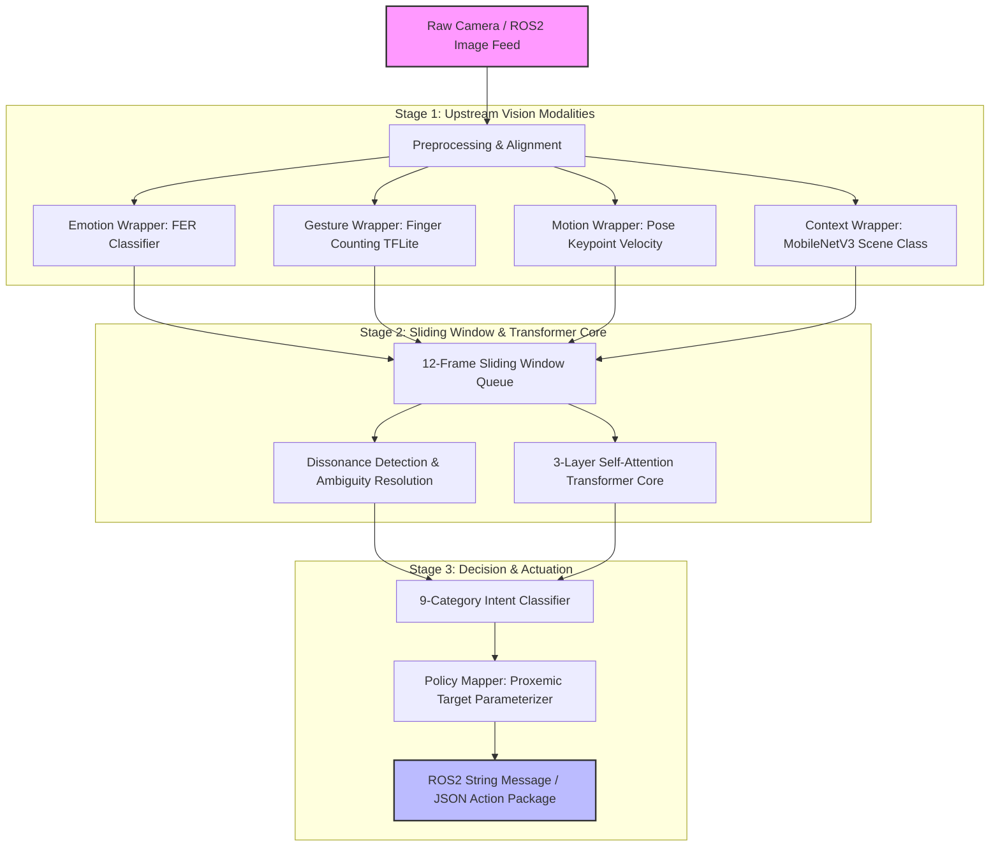

# 🎓 Architectural Walkthrough: Multimodal Cross-Modal Network (MCN)
### *A Masterclass Guide to Designing and Deploying Adaptive HRI Social Brains*

Welcome to the **complete system walkthrough** for your Final Year Project (FYP). This document is written as an educational deep-dive. It outlines the design decisions, mathematical and structural concepts, optimization techniques, and deployment strategies that we implemented to build this real-time HRI pipeline.

---

## 1. The Core Philosophy of MCN
Traditional robot interaction models are **monolithic and reactive**—they read a single cue (like a spoken command or a face) and immediately execute a hardcoded response. 

However, real-world Human-Robot Interaction (HRI) is highly **ambiguous and dynamic**:
*   A user might **smile** (positive emotion) but **point urgently** to a fire (emergency gesture).
*   A user might **run** (high speed motion) in a **corridor** (narrow context) vs. **running** in a **gymnasium** (open context).

The **Multimodal Cross-Modal Network (MCN)** acts as the robot's **"Social Brain"**. It continuously aligns separate, asynchronous visual features, buffers them over a short temporal window, detects conflicting signals (dissonance), and uses a **Transformer Attention Network** to decode the user's underlying intent, mapping it to a targeted social navigation policy.

---

## 2. Technical System Architecture

The entire project operates as a hierarchical data flow, divided into three stages: **Upstream Modalities**, **Temporal Fusion**, and **Policy Mapping**.



### **Stage 1: Upstream Vision Modalities**
Instead of feed-forwarding a massive raw video frame directly into a heavy end-to-end model (which would run at <1 FPS on edge hardware), we use **modular feature extraction**:
1.  **Emotion (Facial Affect)**: Evaluates user comfort levels (Angry, Happy, Confused, Neutral, etc.).
2.  **Gesture (Skeletal Hands)**: Uses MediaPipe Hands to locate joint keypoints, feeding normalized coordinates into a custom, ultra-lightweight `.tflite` model to identify pointing, waving, or finger counts.
3.  **Motion (Full-Body Kinematics)**: Extracts Pose landmarks to calculate the lateral ($v_x$), vertical ($v_y$), and depth-wise ($v_z$) velocity vectors of the user's center of mass.
4.  **Context (Environmental Scene)**: Employs a MobileNetV3 model to identify the spatial environment.

### **Stage 2: Sliding Window & Transformer Core**
Human behavior is not instantaneous. A single isolated frame of a raised hand could mean a greeting, an emergency signal, or simply someone scratching their head. 
*   **Temporal Queue**: We store a sliding buffer of **12 frames** at a throttled **10Hz frequency** (representing a **1.2-second window** of human behavior).
*   **Self-Attention Core**: The 12-frame matrix is passed through a **3-Layer Transformer Core**. The self-attention layers compute spatial-temporal associations, mapping correlations between face expressions, speed of motion, and gestures across time.
*   **Dissonance Layer**: Simultaneously, a rule-based statistical dissonance module calculates divergence between modalities (e.g., negative facial expression vs. positive gestures), alerting the Transformer core to allocate higher attention weights to *safety-critical* inputs.

### **Stage 3: Decision & Actuation (Policy Mapping)**
*   The Transformer's final hidden state is projected onto 9 intent classification heads (e.g., `EMERGREETING`, `HELP_REQUEST`, `EMERGENCY`, `NEUTRAL_PASS`).
*   The decoded intent is parsed by the **Policy Mapper**, which generates a structured JSON payload telling the robot's hardware controllers exactly how to behave:
    ```json
    {
      "predicted_intent": "HELP_REQUEST",
      "intent_probability": 0.95,
      "scenario_id": "S_04",
      "behavioral_policy": {
        "proxemic_action": "APPROACH_SAFE_SLOW",
        "social_buffer_zone_radius": 0.8,
        "vocal_affect_tone": "SUPPORTIVE_HELPFUL",
        "target_linear_velocity": 0.2,
        "target_angular_velocity": 0.1
      }
    }
    ```

---

## 3. Key Engineering Breakthroughs We Coded

### **Breakthrough 1: Edge CPU Optimization (Saving 500MB of RAM)**
Initially, gesture classifiers relied on the full `tensorflow` library for running keypoint and history classification. This loaded a massive 500MB dependency, which would lag or crash edge nodes (like Jetson Nano) during live execution.
*   **The Fix**: We restructured `keypoint_classifier.py` and `point_history_classifier.py` with custom **dynamic imports**. If standard `tensorflow` is missing, it dynamically loads `tflite_runtime.interpreter` instead.
*   **The Outcome**: Reduced the package memory footprint from **500MB to under 2MB**, allowing real-time 10Hz inference on standard edge CPUs without lagging the ROS2 network!

### **Breakthrough 2: ROS2 VNC Graphical Simulation Capability**
Testing a graphical AI camera pipeline inside a headless cloud terminal (where no camera or monitor is attached) is incredibly difficult.
*   **The Fix**: We developed `pipeline/test_publisher.py` to stream video frames (using the unignored, lightweight `TestVideos/1.mp4` file) directly into the ROS2 camera topic `/camera/color/image_raw`. 
*   We then integrated **X11 DISPLAY detection** into `ros2_mcn_node.py`. If it detects you have ConstructSim's VNC "Graphical Interface" desktop open, it automatically triggers `cv2.imshow` to render a gorgeous annotated visual HUD in your browser tab. If run headless, it skips rendering to prevent crashes.

---

## 4. How the ROS2 Graph Works (Headless Pub/Sub Topology)

When running your system inside ROS2 Humble, the nodes communicate via standard message topics:


1.  **`/camera/color/image_raw`**: A continuous ROS2 image stream. Our node handles frame rate throttling inside `image_callback` (processing every 2nd frame) to avoid building queue latency.
2.  **`/mcn/behavioral_policy`**: The output topic. The final behavioral JSON policy is packaged as a standard `std_msgs/String` message, ready to be read by standard ROS2 navigation nodes or robot behavior trees.

---

## 5. Summary of Best Coding Practices Implemented
*   **Robust CWD Recovery**: Wrapped the temporary directory-switching logic in `our_gesture_model.py` in a strict `try...finally` block. This guarantees that even if a TFLite model is missing or corrupted on disk, the working directory is immediately restored to the project root, keeping all other vision models healthy and active.
*   **Platform Neutrality**: Maintained strict case-insensitive file handling (e.g. `TestVideos` vs `testVideos`) and forward slash directories to keep the workspace completely interchangeable between Windows local runtimes and Linux ROS2 distributions.
*   **Locked Dependencies**: Isolated OpenCV, ROS2 `cv_bridge`, PyTorch, and MediaPipe library constraints to completely resolve the common Python `_ARRAY_API` / NumPy version conflict.
