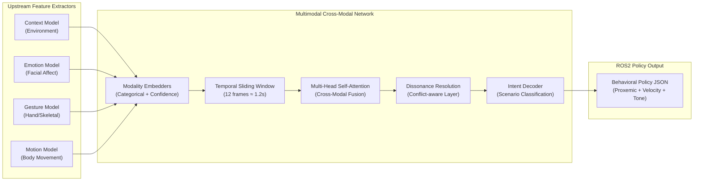
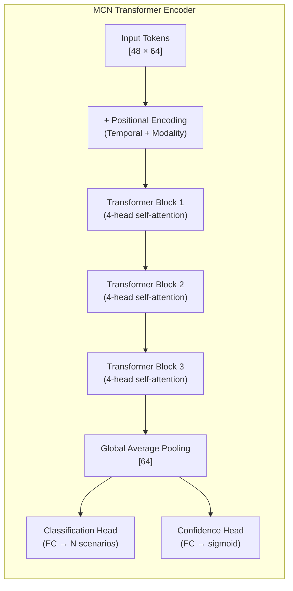

# Multimodal Cross-Modal Network (MCN) — Implementation Plan

## Goal

Build the **Multimodal Cross-modal Network (MCN)** — the central fusion engine ("Social Brain") of your adaptive HRI robot. The MCN ingests 4 concurrent categorical + confidence streams from discrete upstream vision models, applies **late-fusion self-attention** with a **temporal sliding window**, resolves **behavioral dissonance / semantic ambiguity**, and decodes a unified **Scenario ID → ROS2 Behavioral Policy** in real-time on the NVIDIA Jetson Orin Nano.

---

## System Context



---

## User Review Required

> [!IMPORTANT]
> **Models Not Yet Added**: You mentioned the 4 upstream models will be added later. This plan assumes the MCN receives **pre-computed categorical labels + confidence scores** (not raw images). The MCN does NOT do any vision processing — it only fuses the outputs. Please confirm this is correct.

> [!IMPORTANT]
> **Scenario Count**: Your report mentions 60+ Isaac Sim scenarios, but the HRI_Scenarios.pdf currently defines **15 scenarios** across 3 environments (Classroom, Kitchen, Office). The system prompt adds 3 more example scenarios (Hospital/Retail/Museum contexts). Should we:
> - **(A)** Build the MCN to handle only the 15 defined scenarios for now, with architecture extensible to 60+?
> - **(B)** Define all 60+ scenarios upfront before building?

> [!WARNING]
> **Environment Categories Mismatch**: The system prompt lists environments as `[Classroom, Hospital, Museum, Retail Store, Clinic, Open Lobby, Narrow Hallway]`, but the HRI_Scenarios PDF uses `[Classroom, Office, Kitchen]`. Which set of environments should the MCN support? Should it support **both** sets (merged)?

---

## Open Questions

> [!IMPORTANT]
> **Q1 — Training Data Strategy**: Since there's no unified dataset with all 4 modalities labeled together, how do you plan to generate training data for the MCN?
> - **(a)** Manually create labeled CSV/JSON tuples `(C_state, C_conf, E_state, E_conf, G_state, G_conf, M_state, M_conf) → Scenario_ID`?
> - **(b)** Use NVIDIA Isaac Sim to generate synthetic multi-cue sequences?
> - **(c)** Both — synthetic sequences + manual scenario tuples?

> [!IMPORTANT]
> **Q2 — Inference Framework**: Which ML framework should we use?
> - **(a)** PyTorch (recommended — best TensorRT export path via `torch2trt` or `torch.onnx`)
> - **(b)** TensorFlow/Keras
> - **(c)** Pure ONNX from scratch

> [!IMPORTANT]
> **Q3 — ROS2 Integration Scope**: Should this plan include the ROS2 node wrapper (subscriber/publisher) or focus only on the ML model + inference script?

---

## Proposed Architecture

### Phase 1: Input Representation & Embedding

Each input frame at 10Hz contains 4 modality pairs:

```
Input Vector (per frame):
┌─────────────────────────────────────────────────────┐
│ C_state (categorical) │ C_conf (float 0-1)          │
│ E_state (categorical) │ E_conf (float 0-1)          │
│ G_state (categorical) │ G_conf (float 0-1)          │
│ M_state (categorical) │ M_conf (float 0-1)          │
└─────────────────────────────────────────────────────┘
```

**Embedding Strategy:**

| Modality | Categories | Embedding |
|----------|-----------|-----------|
| Context (C) | Classroom, Hospital, Museum, Retail Store, Clinic, Open Lobby, Narrow Hallway, Office, Kitchen | Learnable embedding `d_emb = 32` |
| Emotion (E) | Happy, Sad, Angry, Panicked, Neutral, Confused, Hostile | Learnable embedding `d_emb = 32` |
| Gesture (G) | One Hand Up, Hand Waving, Pointing, Open Palm, Stop Signal, No Gesture, Beckoning, Reaching, Arms Up, Arms Waving | Learnable embedding `d_emb = 32` |
| Motion (M) | Sitting, Walking, Running, Stationary, Approaching, Leaving, Passing Across, Backing Away, Minimal | Learnable embedding `d_emb = 32` |

Each modality token = `[categorical_embedding ⊕ confidence_scalar_projection]` → `d_model = 64`

So each frame produces **4 tokens** of dimension 64.

---

### Phase 2: Temporal Sliding Window

- **Window size**: 12 frames (≈ 1.2 seconds at 10Hz)
- **Token sequence length**: `12 frames × 4 modalities = 48 tokens`
- Learnable **positional encoding** encodes both:
  - **Temporal position** (which frame in the window: 0–11)
  - **Modality type** (which of the 4 modalities: C, E, G, M)

```
X_input shape: [batch, 48, d_model=64]
```

---

### Phase 3: Cross-Modal Self-Attention Transformer



**Architecture Details:**

| Parameter | Value | Rationale |
|-----------|-------|-----------|
| `d_model` | 64 | Small enough for edge, large enough for 4 modalities |
| `n_heads` | 4 | One attention head per modality conceptually |
| `n_layers` | 3 | Lightweight for Jetson Orin Nano |
| `d_ff` | 128 | 2× expansion in FFN |
| `dropout` | 0.1 | Regularization |
| `sequence_length` | 48 | 12 frames × 4 modalities |
| Total parameters | ~50K–100K | Extremely lightweight for edge deployment |

**Key Design Decisions:**
1. **Self-attention across ALL 48 tokens** — this means every modality at every timestep can attend to every other modality at every other timestep. This is the "late fusion" that avoids sequential IF-THEN logic.
2. **No modality-specific encoders** needed because inputs are already categorical embeddings (not raw images).
3. **Confidence-aware gating**: Each modality's embedding is scaled by its confidence score before attention, implementing the "dynamic re-weighting" requirement.

---

### Phase 4: Dissonance Resolution Layer

After the transformer encoder, a dedicated **dissonance detection head** identifies cross-modal conflicts:

```python
# Pseudo-architecture
class DissonanceAwareDecoder(nn.Module):
    def __init__(self):
        self.conflict_detector = nn.Linear(d_model, num_conflict_types)
        # Conflict types: NO_CONFLICT, EMOTION_GESTURE_CONFLICT,
        #                 EMOTION_MOTION_CONFLICT, GESTURE_MOTION_CONFLICT,
        #                 MULTI_CONFLICT
        self.intent_classifier = nn.Linear(d_model + num_conflict_types, num_scenarios)
```

This ensures that conflicts like "Angry face + Waving hand" are treated as **unique states** (e.g., `FRUSTRATED_HELP_REQUEST`) rather than errors.

---

### Phase 5: Output — Scenario Classification & Policy Mapping

**Classification Output:**

The model outputs a probability distribution over all defined scenarios:

| Intent Category | Scenarios Covered |
|----------------|-------------------|
| `HELP_REQUEST` | C1, O4, K1 |
| `NEUTRAL_PASS` | C2, O1, K5 |
| `GIVE_WAY` | C3, C4, O2, K4 |
| `EMERGENCY` | C5, O5, K2 |
| `GREETING` | O3 |
| `TASK_ASSIST` | K3 |
| `HOSTILE_CONFRONTATION` | (from system prompt SCENARIO_ID_99) |
| `DISTRESSED_STUDENT_QUERY` | (from system prompt SCENARIO_ID_74) |

**Policy Mapping Table** (deterministic lookup after classification):

```json
{
    "HELP_REQUEST": {
        "proxemic_action": "APPROACH_AND_ENGAGE",
        "target_linear_velocity": 0.20,
        "social_buffer_zone_radius": 1.50,
        "vocal_affect_tone": "GENTLE_SUPPORTIVE"
    },
    "EMERGENCY": {
        "proxemic_action": "YIELD_AND_ALERT",
        "target_linear_velocity": 0.0,
        "social_buffer_zone_radius": 3.00,
        "vocal_affect_tone": "URGENT_ALERT"
    },
    "GIVE_WAY": {
        "proxemic_action": "MOVE_ASIDE",
        "target_linear_velocity": 0.15,
        "social_buffer_zone_radius": 2.00,
        "vocal_affect_tone": "POLITE_NEUTRAL"
    },
    "NEUTRAL_PASS": {
        "proxemic_action": "MAINTAIN_COURSE",
        "target_linear_velocity": 0.30,
        "social_buffer_zone_radius": 1.00,
        "vocal_affect_tone": "IDLE"
    },
    "GREETING": {
        "proxemic_action": "APPROACH_AND_STOP",
        "target_linear_velocity": 0.25,
        "social_buffer_zone_radius": 1.20,
        "vocal_affect_tone": "WARM_FRIENDLY"
    },
    "TASK_ASSIST": {
        "proxemic_action": "APPROACH_TARGET_OBJECT",
        "target_linear_velocity": 0.20,
        "social_buffer_zone_radius": 1.50,
        "vocal_affect_tone": "INFORMATIVE"
    },
    "HOSTILE_CONFRONTATION": {
        "proxemic_action": "RETREAT_AND_DEESCALATE",
        "target_linear_velocity": -0.10,
        "social_buffer_zone_radius": 3.50,
        "vocal_affect_tone": "CALM_DEESCALATION"
    }
}
```

---

## Proposed File Structure

```
d:\FYP_Tranformer\
├── mcn/                              # Multimodal Cross-Modal Network
│   ├── __init__.py
│   ├── config.py                     # [NEW] Hyperparameters, categories, scenario definitions
│   ├── model.py                      # [NEW] MCN Transformer model (PyTorch)
│   ├── embeddings.py                 # [NEW] Modality embedding layers
│   ├── temporal_window.py            # [NEW] Sliding window buffer
│   ├── dissonance.py                 # [NEW] Conflict detection module
│   ├── policy_mapper.py              # [NEW] Scenario ID → Behavioral Policy JSON
│   ├── dataset.py                    # [NEW] Dataset class for training tuples
│   ├── train.py                      # [NEW] Training loop
│   ├── inference.py                  # [NEW] Real-time inference pipeline
│   └── export_tensorrt.py            # [NEW] ONNX/TensorRT export script
├── data/
│   ├── scenarios.json                # [NEW] All scenario definitions with trigger cues
│   └── training_tuples/              # [NEW] Training data (generated or manual)
├── tests/
│   ├── test_model.py                 # [NEW] Unit tests for MCN
│   ├── test_scenarios.py             # [NEW] Golden trial scenario tests
│   └── test_dissonance.py            # [NEW] Conflict resolution tests
└── configs/
    └── mcn_config.yaml               # [NEW] Deployable config file
```

---

## Implementation Phases

### 🔹 Phase 1: Foundation (config + embeddings + data)
1. Define all categorical vocabularies and scenario mappings in `config.py`
2. Build `scenarios.json` with all 15+ scenarios and their trigger cues
3. Implement modality embedding layers in `embeddings.py`
4. Create `dataset.py` for loading training tuples

### 🔹 Phase 2: Core Model
5. Implement `temporal_window.py` — sliding buffer for 12 frames
6. Build `model.py` — the transformer encoder with cross-modal self-attention
7. Implement `dissonance.py` — conflict detection head
8. Build `policy_mapper.py` — deterministic Scenario → Policy lookup

### 🔹 Phase 3: Training Pipeline
9. Implement `train.py` with:
   - Cross-entropy loss for scenario classification
   - Auxiliary conflict detection loss
   - Confidence-weighted input augmentation
10. Generate/collect training data

### 🔹 Phase 4: Inference & Integration
11. Build `inference.py` — real-time frame processing pipeline
12. Implement JSON output schema matching the ROS2 behavioral policy format
13. Add `export_tensorrt.py` for edge deployment

### 🔹 Phase 5: Testing & Validation
14. Unit tests for each module
15. Golden Trial tests using the 15 defined scenarios
16. Rule-based vs MCN comparison tests (reproducing Table from HRI_Scenarios.pdf Page 3)

---

## Training Strategy

### Loss Function
```
L_total = α · L_intent + β · L_dissonance + γ · L_confidence
```

| Component | Description | Weight |
|-----------|------------|--------|
| `L_intent` | Cross-entropy over scenario classes | α = 1.0 |
| `L_dissonance` | Binary cross-entropy for conflict detection | β = 0.3 |
| `L_confidence` | MSE between predicted and true intent probability | γ = 0.2 |

### Data Augmentation
- **Confidence jittering**: Randomly perturb confidence scores (±0.1) to simulate sensor noise
- **Modality dropout**: Randomly zero out one modality's embedding to train robustness when a sensor fails
- **Temporal shuffling**: Slight perturbations in frame order to handle real-world jitter
- **Conflict injection**: Synthetically create dissonant tuples (e.g., Happy + Stop Signal) to train the dissonance head

---

## Verification Plan

### Automated Tests
1. **Unit tests**: `python -m pytest tests/` — model forward pass, embedding dimensions, window buffer
2. **Scenario coverage**: Feed each of the 15 defined scenarios and verify correct intent classification
3. **Dissonance tests**: Feed known conflicting inputs and verify the model doesn't crash but produces valid outputs
4. **Rule-Based Comparison**: Reproduce the "Rule-Based Failure vs Fusion Outcome" table from HRI_Scenarios.pdf and verify MCN matches the "Correct (Fusion)" column

### Manual Verification
- **Latency benchmark** on Jetson Orin Nano (target: <100ms per frame)
- **Golden Trial** with real human volunteers performing the 15 scenarios
- **Edge case testing**: What happens with all-zero confidences? All same emotion? Rapid state changes?

---

## Key Technical Decisions Summary

| Decision | Choice | Why |
|----------|--------|-----|
| Fusion approach | Late fusion (categorical inputs) | Upstream models are separate; MCN only fuses their outputs |
| Architecture | Transformer encoder | Self-attention naturally handles cross-modal + temporal dependencies |
| Model size | ~50-100K params | Must run <100ms on Jetson Orin Nano |
| Window | 12 frames (1.2s) | Balances temporal context vs latency |
| Framework | PyTorch | Best TensorRT export path for Jetson |
| Classification | Multi-class over intent categories | Maps directly to behavioral policies |
| Conflict handling | Dedicated dissonance head | Treats conflicts as features, not errors |
